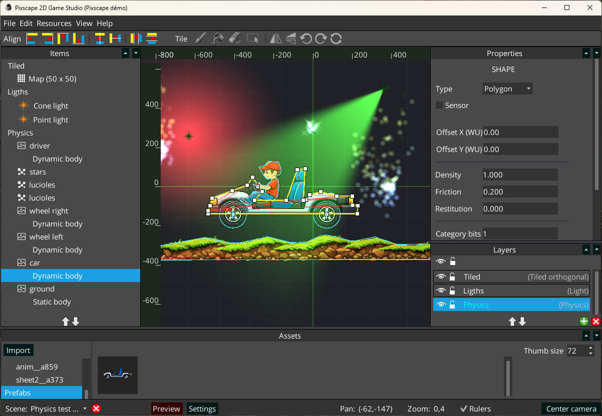

<h1 >Pixscape Runtime</h1>

<strong></strong>

 

 
 

**Performance-oriented 2D runtime for Pixscape editor.**

➡️ **Download Pixscape Studio:** https://github.com/pixscapegames/pixscape-studio-releases  
🌐 **Website:** https://pixscape.games/  
📘 **Documentation:** https://pixscape.games/docs  
📝 **Changelog:** [CHANGELOG.md](CHANGELOG.md)

## What is Pixscape Runtime?

Pixscape Runtime is the open-source core powering **Pixscape Studio**.

It is a high-performance 2D runtime built on top of **LibGDX** and **Artemis-ODB ECS**, designed for lightweight workflows, fast iteration and multiplatform deployment.

The runtime focuses on:
- Performance-oriented ECS architecture
- Modern SOA-style rendering pipelines
- Async atlas workflows
- Tiled maps and physics integration
- Desktop, Android and HTML5/WebGL2 deployment

Pixscape Studio is the recommended way to build games with Pixscape.  
The runtime repository is also available separately for developers who want direct engine-level access, advanced customization, or full code integration inside existing LibGDX projects.

## Documentation

Full documentation is available on the official website:📘 https://pixscape.games/docs

## Download Pixscape Studio
Pixscape Studio builds are available here: ➡️ https://github.com/pixscapegames/pixscape-studio-releases
